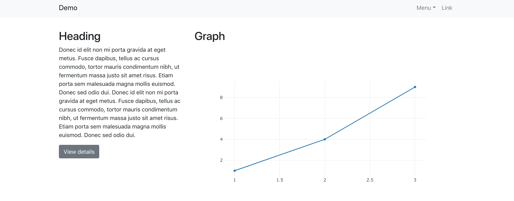

# dash-bootstrap-components

[Plotly Dash][dash-homepage] is great! However, creating the initial
layout can require a lot of boilerplate. *dash-bootstrap-components*
reduces this boilerplate by providing standard layouts and high-level
components.

*dash-bootstrap-components* provides [Bootstrap][bootstrap-homepage]
components. It is built on top of [reactstrap][reactstrap-homepage].

## Installation

*dash-bootstrap-components* is hosted on PyPI, and can be installed by
running

```
pip install dash-bootstrap-components
```

## Documentation

Head over to the [*documentation*][docs-homepage] for tutorials and
the API reference.

## Layouts and components

*dash-bootstrap-components* includes several high-level components
that can be composed with each other or with components in
[dash-core-components](https://dash.plot.ly/dash-core-components).

### Standard row and column-based layouts



---

### Cards


---

### Tabs


---

### Forms


---

### Dropdowns


---

### Tooltips


... and many more. For a full list of components, head over to [the documentation][docs-components].

[dash-homepage]: https://dash.plot.ly/
[bootstrap-homepage]: https://getbootstrap.com/
[dbc-repo]: https://github.com/facultyai/dash-bootstrap-components
[reactstrap-homepage]: https://reactstrap.github.io/
[docs-homepage]: https://dash-bootstrap-components.opensource.faculty.ai
[docs-components]: https://dash-bootstrap-components.opensource.faculty.ai/l/components
